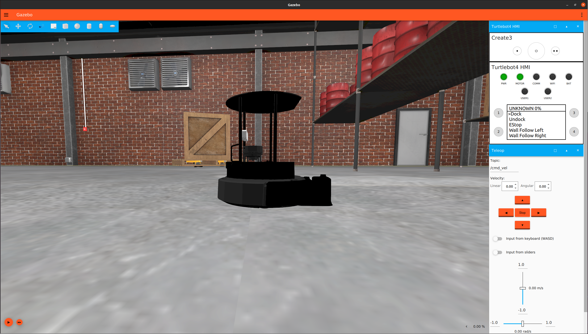

# ROS2

## ROS2 Distributions

A ROS distribution is a versioned set of ROS packages. These are akin to Linux distributions (e.g. Ubuntu). The purpose of the ROS distributions is to let developers work against a relatively stable codebase until they are ready to roll everything forward. Therefore once a distribution is released, we try to limit changes to bug fixes and non-breaking improvements for the core packages (every thing under ros-desktop-full). That generally applies to the whole community, but for “higher” level packages, the rules are less strict, and so it falls to the maintainers of a given package to avoid breaking changes.

In this tutorial, we will use the Humble distribution.

## ROS2 setup

[Here](https://docs.ros.org/en/humble/Installation/Ubuntu-Install-Debians.html) is the guide to install ROS2 and source it to the Humble distribution.

## ROS2 configuration

[Here](https://docs.ros.org/en/humble/Tutorials/Beginner-CLI-Tools/Configuring-ROS2-Environment.html) is the link for configuring the ROS2 environment.

## ROS2 Launch Gazebo

In ROS2, you can launch python applications with the Launch command. In this tutorial, the application launched will be a Turtlebot4 Simulator, Gazebo.

First, Ignition Fortress must be installed:

    sudo apt-get update && sudo apt-get install wget
    sudo sh -c 'echo "deb http://packages.osrfoundation.org/gazebo/ubuntu-stable `lsb_release -cs` main" > /etc/apt/sources.list.d/gazebo-stable.list'
    wget http://packages.osrfoundation.org/gazebo.key -O - | sudo apt-key add -
    sudo apt-get update && sudo apt-get install ignition-fortress

You can manually install this metapackage from source, cloning the git repository:

    cd ~/turtlebot4_ws/src
    git clone https://github.com/turtlebot/turtlebot4_simulator.git -b humble

Installing dependencies:

    cd ~/turtlebot4_ws
    rosdep install --from-path src -yi

Building the packages:

    source /opt/ros/humble/setup.bash
    colcon build --symlink-install

With all installed, now run the simulator with the default settings:

    ros2 launch turtlebot4_ignition_bringup turtlebot4_ignition.launch.py

Now the gazebo window will be opened

You can close the Gazebo window, since in this tutorial we will not use it in this section.
